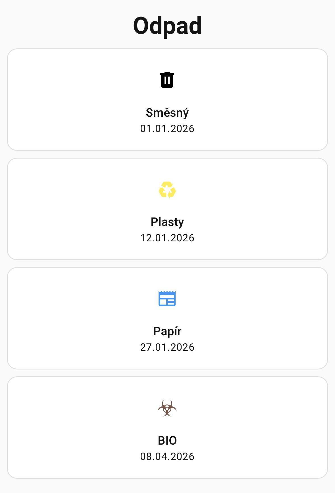
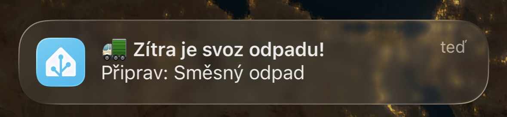

# Odpad obce Dětmarovice (část Glembovec) pro Home Assistant

## Je potřeba mít nainstalované následující oficiální doplňky
- File editor (pro editaci `configuration.yaml`)
- Terminal & SSH (pro instalaci `HACS` doplňku)

## V HACS doplňku je potřeba nainstalovat následující neoficiální doplňek
- <a href=https://github.com/mampfes/hacs_waste_collection_schedule>Waste Collection Schedule</a>

## Konfigurace
1. Je potřeba nastavit doplňěk a senzory v `configuration.yaml`, viz přiložený soubor
2. Je potřeba vytvořit soubor `odpad_2026.ics` ve stejném adresáři, v jakém se nachází `configuration.yaml` a vložit do nej události, viz přiložený soubor `odpad_2026.ics`
3. Ověříme, že jsme nikde neudělali chybu `Nástroje pro vývojáře -> Zkontrolovat nastavení`
4. Restartujte Home Assistant `Nastavení -> Systém -> Restartovat Home Assistanta`

## Ovládací panel
Vytvořte si nový ovládací panel, viz. `view.yaml`, který si pak můžete přízpůsobit podle sebe

## Notifikace na mobil
Vytvořte si automatizaci, viz. `automation.yaml`, kterou si pak můžete přízpusobit podle sebe

